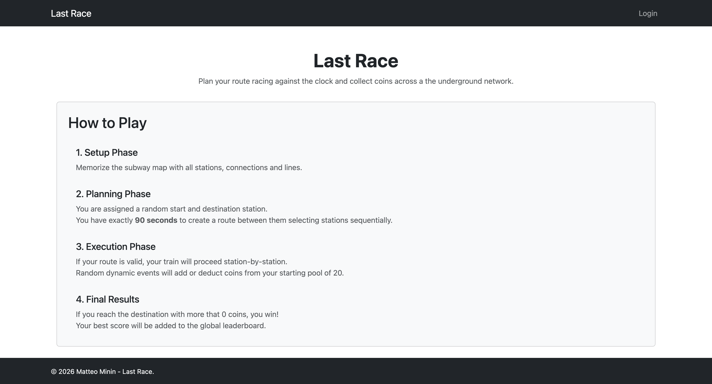
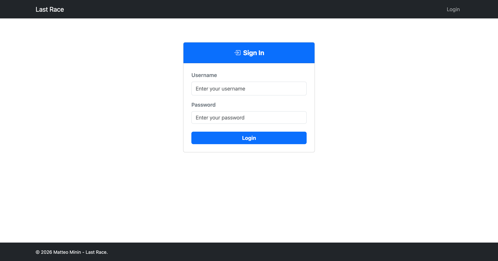
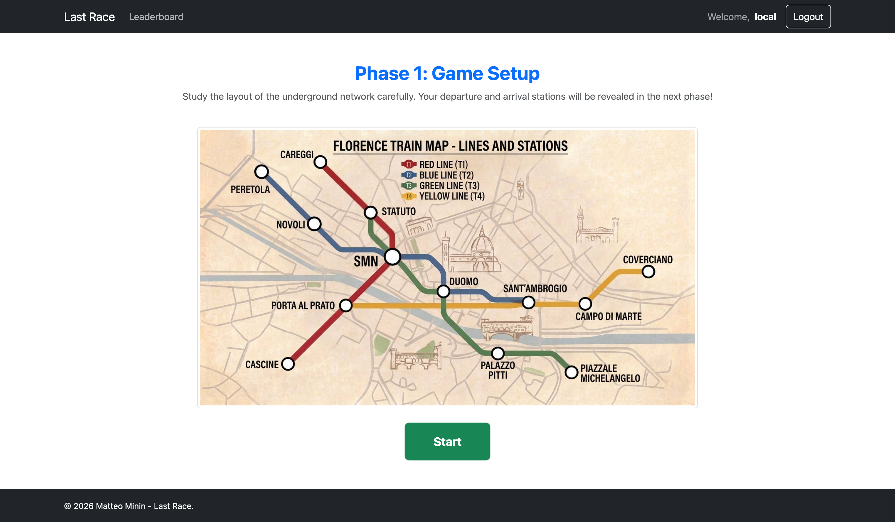
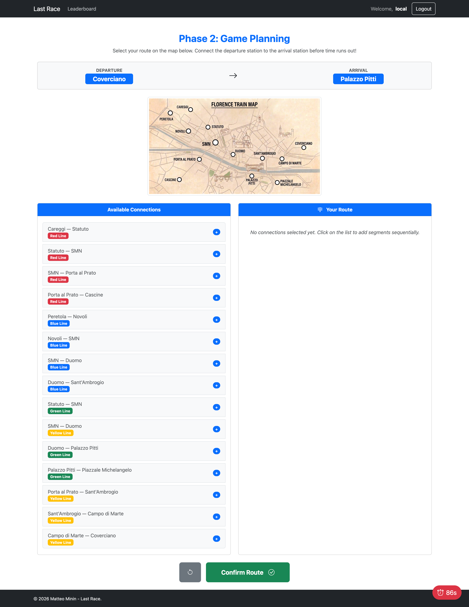
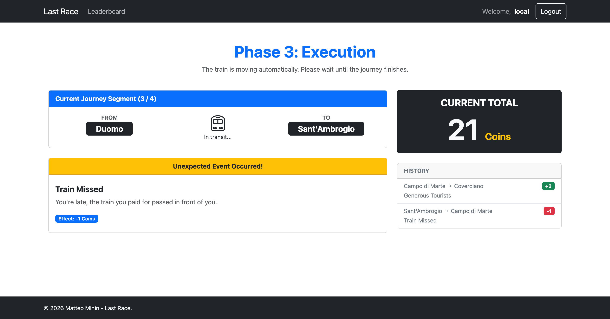
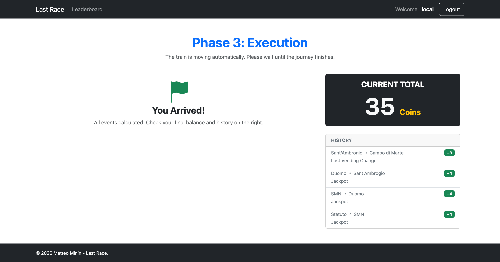
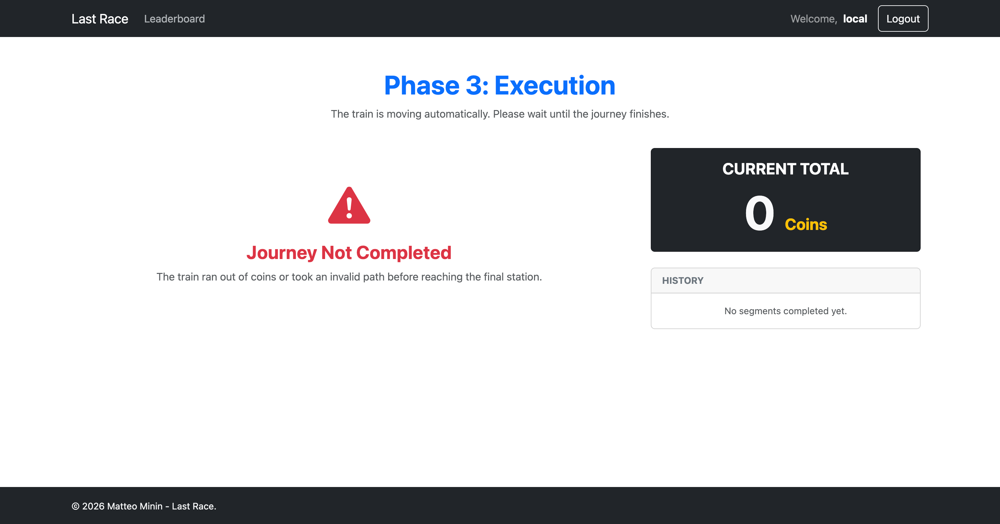
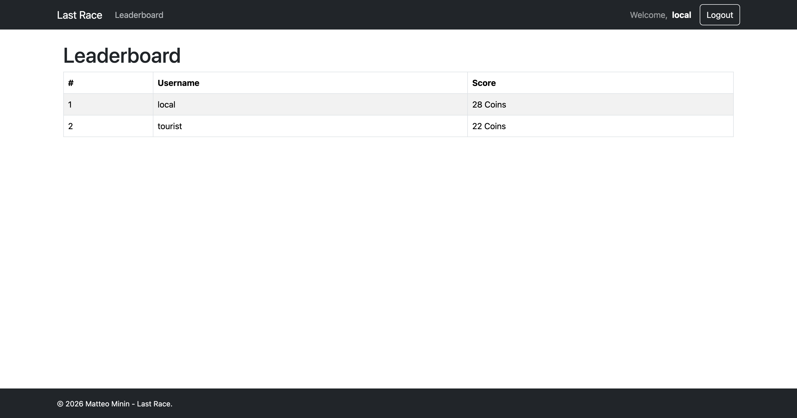

# Exam #1: "Last Race"
## Student: s364179 MININ MATTEO

## React Client Application Routes

- Route `/`: Home page with game instructions and a start game button available to authenticated users.
- Route `/login`: Login page for users.
- Route `/game`: Main game page used for setup, planning, execution, and result phases.
- Route `/leaderboard`: Global ranking page for authenticated users.
- Route `*`: Not found page.

## API Server

- Base URL: `http://localhost:3001/api/v1`

- POST `/api/v1/sessions`
  - login with `username` and `password` in the request body
  - response: `{ id, username }`
  - returns `201` on successful authentication

- GET `/api/v1/sessions/current`
  - returns the authenticated user associated to the current session
  - response: `{ id, username }`
  - requires authentication, returns `401` if not authenticated

- DELETE `/api/v1/sessions/current`
  - deletes the current session
  - response: empty body

- GET `/api/v1/map`
  - returns map data for the game
  - response: `{ lines, stations, segments }`
  - requires authentication, returns `401` if not authenticated 
  - return `500` if can't featch the map

- POST `/api/v1/games`
  - starts a new game for the authenticated player
  - response: newly created game object
  - requires authentication, returns `401` if not authenticated
  - returns `400` if the player already has an active game

- GET `/api/v1/games/current`
  - returns the authenticated player's active game
  - response: active game object
  - requires authentication, returns `401` if not authenticated
  - returns `404` if no active game exists

- PUT `/api/v1/games/:id/start`
  - starts the specified active game and sets `started_at`
  - response: updated game object
  - requires authentication, returns `401` if not authenticated

- PUT `/api/v1/games/current`
  - updates the authenticated player's current game with the submitted route
  - request body: route array of selected segments
  - response: updated game result including execution steps `{...game, steps}`
  - requires authentication, returns `401` if not authenticated

- GET `/api/v1/leaderboard`
  - returns the leaderboard of top players
  - response: array of `{ username, record }`
  - requires authentication, returns `401` if not authenticated

## Database Tables

- Table `users` - contains `id`, `username`, `hash`, `salt`
- Table `lines` - contains `id`, `name`
- Table `stations` - contains `id`, `name`
- Table `segments` - contains `id`, `station1_id`, `station2_id`, `line_id`
- Table `events` - contains `id`, `name`, `description`, `effect`
- Table `games` - contains `id`, `player_id`, `status`, `start_station_id`, `end_station_id`, `coins`, `route`, `started_at`, `created_at`

## Main React Components

- `App` (in `App.jsx`): Defines client-side routing and protected routes.
- `Home` (in `Home.jsx`): Displays game instructions and the start game button.
- `Login` (in `Login.jsx`): Handles user login.
- `Layout` (in `Layout.jsx`): Page layout with header and footer.
- `ProtectedRoute` (in `ProtectedRoute.jsx`): Restricts access to authenticated users.
- `Leaderbord` (in `Leaderbord.jsx`): Shows the global leaderboard.
- `Game` (in `Game.jsx`): Orchestrates game phases.
- `GameSetup` (in `GameSetup.jsx`): Shows the full network map and allows the user to begin the game.
- `GamePlanning` (in `GamePlanning.jsx`): Planning phase (timed 90 seconds), shows the list of segments and allows route creation.
- `GameResults` (in `GameResults.jsx`): Displays final score and game result after route execution.

## Screenshot

## Users Credentials

- local, local!
- tourist, tourist!
- teacher, teacher! (new account, no games played)

## Use of AI Tools
AI tools have been used for the following purposes:

- Image Generation (Gemini): AI tools were used to design and create the map assets.

- Coding Assistance: GitHub Copilot was used during development for inline code suggestions.

- Debugging & Architecture: Gemini was consulted to research best practices and troubleshoot non-trivial bugs.

All AI-generated code was manually reviewed.